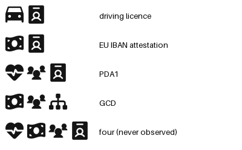

# Iconography: the category glyphs

**Status: every glyph choice below is Daniel Hardman's, made 2026-09-24 from rendered candidates. So are the three rules marked "his". Everything else is synthesized: the rules a session actually followed while producing his choices, with the reason for each. None of it is ratified.**

This is the second channel for [credential categories](credential-categories.md). In [posture.md](posture.md), point 7, he asked for kind to be signalled more than one way: *"it means whe shouldn't *only* use color"*. His example was a driving licence carrying a car and a birth certificate carrying a baby. Colour or pattern is the other channel, and it isn't designed here. Which axis rides on which channel is still open in credential-categories.md.

## The set


Nineteen glyphs: seven categories with a glyph of their own, ten subcategories, and `misc`. [ladder.png](iconography/ladder.png) shows each one at 32, 64 and 128 px, so the claim that each survives at 32 px can be checked. The SVGs are in [iconography/glyphs/](iconography/glyphs/) and are named `category` or `category.subcategory`. A dot separates the two because `org-identity` and `civil-status` already contain a hyphen.

| Glyph | Picture | Source |
|---|---|---|
| `identity` | photo ID badge | Phosphor |
| `identity.travel` | aeroplane | Material Symbols |
| `identity.age` | three life stages | built from Phosphor `person` |
| `identity.address` | house | Phosphor |
| `org-identity` | classical temple front | original, after his sketch |
| `humanness` | full human figure | Phosphor, edited |
| `financial` | banknote | Font Awesome |
| `financial.tax` | receipt | Phosphor |
| `financial.insurance` | umbrella | Fluent |
| `qualification` | rosette medal | Phosphor |
| `qualification.academic` | mortarboard | Font Awesome |
| `qualification.driving` | car | Material Symbols |
| `health` | heart with pulse line | Material Symbols |
| `affiliation` | three busts, asymmetric | Phosphor, edited |
| `authority.delegation` | hierarchy tree | Font Awesome |
| `authority.control` | key | Font Awesome |
| `civil-status.birth` | baby | Phosphor |
| `civil-status.marriage` | solitaire ring | original |
| `misc` | document | Material Symbols |

## The rules

**A glyph is a silhouette.** One path, one colour (`currentColor`), no strokes, no text, no second tone. The colour channel is designed separately and has to be free to tint a glyph without the glyph fighting back. `currentColor` is what lets it.

**Pictograph first, emblem only if we must (his).** A picture of the thing is readable at first glance, which point 5 asks for. A learned emblem, like the RealID star, has to be taught. Every glyph in the set is a pictograph. The nearest thing to an emblem is `authority.delegation`'s tree.

**The emboss test is a way of drawing, never a way of rendering (his).** A candidate has to stay recognizable if you imagine it embossed. That rules out gradients, interior illustration and hairline detail. Nothing is ever actually rendered embossed. He rejected the trial renders, and at 32 px they lost nearly all interior shape anyway.

**No picture of a credential on a credential (his), with one exception.** Travel is an aeroplane, not a passport. The exception is `identity` itself, which is a photo ID badge, because there's no better picture of generic identity.

**Grid.** A 24-unit viewBox. The glyph's larger dimension is scaled to 22 units, leaving one unit of clear space on each side. Wide glyphs (banknote, car, three stages) are allowed to grow toward 23.5 units by a factor of `aspect^0.2`, because at the same width they look smaller than square ones. That exponent was tuned by eye on this set and is not a measurement. See `fit()` in [build.py](iconography/build.py).

**Minimum feature sizes.** In the two originals and the three edits, solid parts are at least 1.6 units thick (about 2 px at 32 px). Gaps that separate overlapping shapes, such as the busts in `affiliation` or the stone above the band in `civil-status.marriage`, are at least 0.9 units (about 1.2 px). The vendored glyphs were chosen by looking at them at 32 px and were not measured against these numbers.

**The size ladder.** 32 px is the floor. The handoff's measurement on `bakobo/schema` showed that interior detail is gone at 32 px and only outline carries, and every glyph here was accepted or rejected on its 32 px render. 64 and 128 px are rendered for checking. Nothing smaller than 32 px has been tested.

**Imagery kept out of the set.** Check marks, crosses, warning triangles, padlocks and shields are left for arcviz's own evaluation signals, where point 6 asks that "something is wrong" be unmistakable. A red or plain Greek cross is avoided because the Red Cross emblem is legally protected. How far that protection reaches for a monochrome plus sign hasn't been checked. `humanness` shows no face and no fingerprint, because it asserts that the holder is a person without saying which one. `affiliation` uses busts, not full figures, because an affiliation can be with something that isn't a person (his).

## Composition



Glyphs sit in a row, 4 px apart at 32 px (one eighth of the glyph). They appear in the order `categories()` returns in [classify.py](../research/credential-types/classify.py), which puts `identity` last whenever it appears with anything else. **When only one glyph fits, the first is shown, so a driving licence shows the car.**

How many glyphs is realistic: of the 85 catalog types whose fields are published, the classifier gives 32 one category, 29 two, 3 three, and none four. Its precision is 0.77, so some of those extra labels are field-presence noise and the real counts are probably lower. The three-glyph cases are PDA1, Health ID and the GCD credential. A row of three is 104 px wide and a row of four is 140 px. Both fit inside a 320 px viewport, but neither has been tried in an actual card layout. **At four or more, nothing is decided.** The obvious candidates are to cap the row at three and list the rest in hover text (point 4's progressive disclosure), or to show the first two plus a count. Both are proposals only.

## Open

- **`authority` and `civil-status` have no category-level glyph.** Only their subcategories have one. A credential the classifier labels `authority` without anything that picks delegation or control currently has nothing to show.
- **Nothing selects a subcategory.** `classify.py` returns categories only. Showing a car instead of the rosette needs a rule that recognizes a driving privilege, and that rule doesn't exist.
- **`authority.control` is a key, and arcviz will also draw KERI key state.** If key state gets a key glyph, one picture will mean two things. This is noted, not resolved.
- **`health` has no vaccination or prescription subcategory.** The syringe and stethoscope were candidates and weren't chosen.
- **The wide-glyph correction** (`aspect^0.2`) is a judgement made by eye.

## Files and licences

| Path | Holds |
|---|---|
| [iconography/glyphs/](iconography/glyphs/) | The nineteen SVGs, one flattened path each. Each carries a comment naming its source and what was changed. |
| [iconography/build.py](iconography/build.py) | Builds `glyphs/` and the three sheets from `sources/`. Every modification to a vendored glyph is made here, in code. |
| [iconography/sources/](iconography/sources/) | The vendored originals, unmodified. |
| [iconography/PROVENANCE.yaml](iconography/PROVENANCE.yaml) | Per asset: project, package and version, file, sha256, licence, where the licence was read, retrieval date, modifications. Also the sets considered and excluded. |
| [iconography/ATTRIBUTION.md](iconography/ATTRIBUTION.md) | The attribution the licences require. Only CC BY 4.0 (Font Awesome) strictly requires credit. Apache-2.0 and MIT require their notices to travel with the files, which `licenses/` does. |
| [iconography/licenses/](iconography/licenses/) | Full licence texts. |

The glyphs are vendored SVGs, not an icon font. An icon font would allow one colour per glyph, is awkward for screen readers, and prevents editing paths. Inline SVG, or a sprite referenced with `<use>`, takes its colour from CSS and carries a `<title>` for hover text.

To rebuild, run this in `docs/design/iconography/` (needs `rsvg-convert`):

```
uv run --with picosvg --with skia-pathops --with pillow python build.py
```
